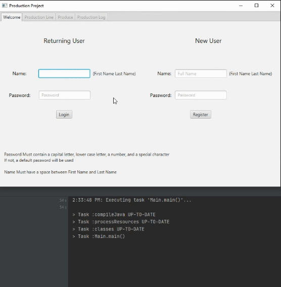
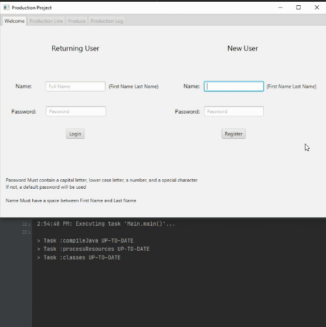
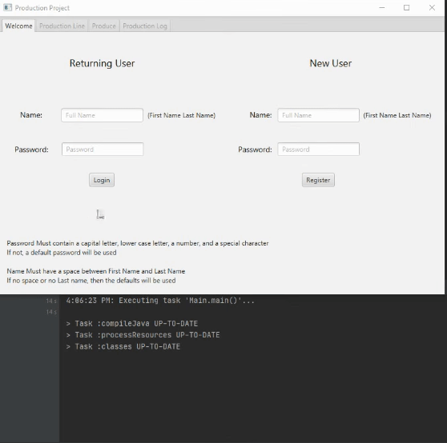
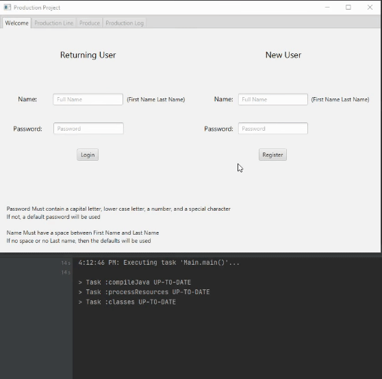

# Production Project

This is a project assignment I created for Professor Vanselow's 
[Object Oriented Programming](https://sites.google.com/site/profvanselow/course/cop-3003) 
class in the Fall 2020 semester. The program is a JavaFX application that acts as a 
production management system.

# Demonstration

Returning User:

New User:

Returning User Error Checking:

New User Error Checking:

